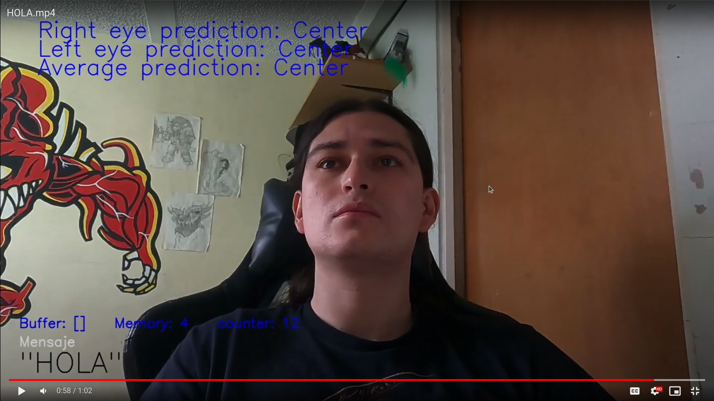

# VocalEye: ocular communication system #

Hello!, welcome to VocalEye, an ocular communication system that uses the [Vocal Eyes Becker communication system](https://patient-innovation.com/post/1705) proposed by Gary and Jason Becker to translate eye movements into letters and words!. This system can 

## Setting up the environment ##
To be able to run this script, it is recommended to use [Anaconda Python's platform](https://www.anaconda.com/) to easy install all the components required. Once you've install it, you can open an Anaconda's prompt and run the following command to install the environment with all the modules needed:

```
$ conda env create --file environment.yml
```

And then activate that environment with the following command:

```
$ conda activate VocalEye
```

Once you've done it, you can run a synthetic test to test it is working:

```
$ python main.py -o synthetic
```

## How to run the system ##

To run the program, you can run the script as

```
$ python main.py
```

With the following parameters:

- `-o`: Operation mode with values between `camera` for a real test with a camera and `synthetic` for a test with a synthetic test video input.
- `-v`: Video device id, being the identifier of the video device input

### Camera operation mode ###

Once you start running the software, the interface is going to show what the camera is capturing with a set of predictions for each eye of their actual position:

  

At the working interface, you can:
- Press `s` to start/stop spelling
- Press `q` to exit

Once you press start, the interface increases to include some running data and the message you are spelling! (Click on the following image to see video test!):

[](https://drive.google.com/file/d/132PIQtCAUbX43Us5XJNVW4IOhV3fo87b/view?usp=drive_link)


As you keep your eyes to a certain position for enough time, the system is going to play a sound telling you that it has recorded that position and you must return to a centered position to confirm it and the it will play a confirmation sound.

## Troubleshoot ##

### Linux access to webcams ###

Be sure that you have the full permisions to your videocapture device on your Linux system. To check this, run this command (For Debian/Ubuntu):

```
v4l2-ctl --list-devices
```

If your permisions are not enough, add permisions to that device as:
```
sudo chmod 777 /dev/video{id}
```

And then include that id as your video input into the script